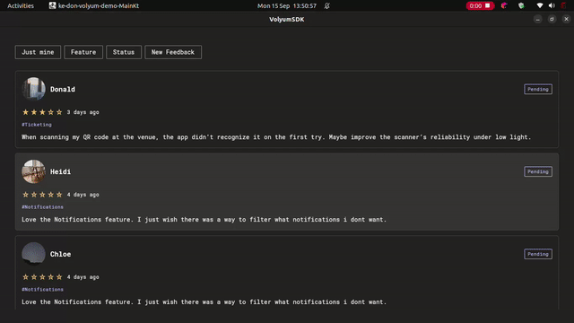
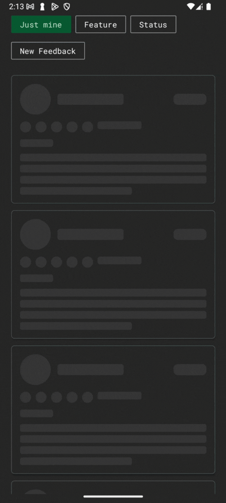

<h1 align="center">📣 Volyum</h1>  

[](https://search.maven.org/artifact/io.github.donald-okara/volyum)

Volyum is a friendly feedback platform designed with Kotlin Multiplatform in mind. It helps developers easily gather valuable feedback from their users right within their app, using the Volyum SDK.

> Note: The platform is still in development. Thank you for being among the first ones here, but the SDK is currently non-functional unless you have valid credentials(how did you get them 😅)

---
## Step 1: Installation
The Volyum SDK is available on **Maven Central** (the default store for Kotlin libraries), so installation is straightforward.

Add this dependency to your `commonMain` (for KMP) or your regular dependencies block:

```kotlin
dependencies {
    implementation("io.github.donald-okara:volyum:$latest_version")
}
```

---

## Step 2: Initialization

Volyum supports **two integration styles**, depending on whether you want a **global singleton** or a **scoped instance** tied to a lifecycle.

---

### 🔑 Global Setup (Singleton with `VolyumSdk`)

If you want one **global Volyum instance** available throughout your app, initialize it once at startup.

#### Android

```kotlin
class MyApp : Application() {
    override fun onCreate() {
        super.onCreate()

        val config = VolyumConfig(
            baseUrl = "https://your.supabase.co",
            apiKey = "your_api_key"
        )
        VolyumSdk.init(config)
    }
}
```

#### iOS (Compose Multiplatform)

```kotlin
fun MainViewController() = ComposeUIViewController {
    // remember ensures config is stable across recompositions
    val config = remember {
        VolyumConfig("https://your.supabase.co", "your_api_key")
    }

    // Initialize SDK once
    LaunchedEffect(Unit) {
        VolyumSdk.init(config)
    }

    App()
}
```

#### Desktop

```kotlin
fun main() {
    val config = VolyumConfig("https://your.supabase.co", "your_api_key")
    VolyumSdk.init(config)

    App() // launch Compose for Desktop
}
```

Access Volyum anywhere:

```kotlin
val volyum = VolyumSdk.get()
```

---

### 🏭 Scoped Setup (Lifecycle-aware with `VolyumFactory`)

If you want Volyum tied to a **screen, feature, or DI scope**, use `VolyumFactory`.  
With **Compose Multiplatform**, you can rely on the multiplatform `ViewModel`.

#### Shared ViewModel (`commonMain`)

```kotlin
import androidx.lifecycle.ViewModel
import ke.don.volyum.feedback.config.*

class FeedbackViewModel : ViewModel() {
    private val config = VolyumConfig("https://your.supabase.co", "your_api_key")
    val volyum: Volyum = VolyumFactory.create(config)
}
```

#### Compose UI (Android, iOS, Desktop)

```kotlin
@Composable
fun FeedbackScreen(viewModel: FeedbackViewModel = androidx.lifecycle.viewmodel.compose.viewModel()) {
    val volyum = viewModel.volyum
    // Use volyum safely here
}
```

👉 This works across all platforms supported by Compose Multiplatform.


---

### ⚖️ Which should I choose?

#### Use **`VolyumSdk.init`** (Global Singleton) if:

- You want **one shared instance** across your entire app.

- You don’t need per-feature configuration.

- Your feedback system should behave consistently everywhere.

- Best for **small to medium apps** or when feedback is a core global feature.


#### Use **`VolyumFactory`** (Scoped Instance) if:

- You need **separate instances** for different screens/features.

- You want to manage feedback lifecycles via **DI** or **ViewModels**.

- You want to **test** with different configurations easily.

- Best for **large apps** or when feedback should behave differently per module.

> Security note
- Do not hardcode real API keys in source control or binaries.
- Prefer injecting the key from secure config (BuildConfig on Android, plist/env on iOS, env vars/args on Desktop/CLI).

## Step 3: Usage
The Volyum API has 3 main methods.

#### `sendFeedback()`
This is the method the app calls to send the feedback from the user.

```kotlin
/**  
 * Sends feedback to the Volyum API. 
 *
 * @param feedback The feedback to send.  
 * @return A [VolyumResult] containing the sent feedback or a [NetworkError] if an error occurred. 
   */
suspend fun sendFeedback(  
    feedback: Feedback,  
): VolyumResult<Feedback, NetworkError> =  
    apiClient.addFeedback(feedback = feedback)
```

*Sample usage*
```kotlin
volyum.sendFeedback(  
    feedback = uiState.value.sendFeedback.copy(  
        userId = userData?.id,  
        targetType = uiState.value.targetType.label,  
        userMetadata = UserMetadata(  
            username = userData?.name,  
            profileUrl = userData?.profileUrl,  
        ),  
    ),  
)
```

#### `getFeedback()`

This is the method that fetches the feedback list from the volyum api. Yes, it supports pagination by default
```kotlin
/**  
 * Retrieves a list of feedback entries based on the provided filter. 
 *
 * This function makes an API call to fetch feedback. The results can be filtered * using the [GetFeedbackFilter] object.  *
 * @param filter The filter criteria to apply when fetching feedback.  
 * @return A [VolyumResult] which is either a [VolyumResult.Success] containing a list of [Feedback] objects *         or a [VolyumResult.Error] containing a [NetworkError] if the request fails. 
*/
   
suspend fun getFeedback(  
    filter: GetFeedbackFilter,  
): VolyumResult<List<Feedback>, NetworkError> =  
    apiClient.getFeedback(filter)
```

*Sample usage*
```kotlin
volyum.getFeedback(
            GetFeedbackFilter(
                userId = userId,
                status = FeedbackStatus.OPEN,
                limit = 20,
                offset = 0
            )
```

#### `getFeedbackById()`
This method fetches a specific feedback item by id

```kotlin
/**  
 * Retrieves a feedback item by its unique identifier. 
 *
 * This function makes an API call to fetch a specific feedback item based on the provided ID. 
 *
 * @param id The unique identifier of the feedback to retrieve.  
 * @return A [VolyumResult] which is either a [VolyumResult.Success] containing the [Feedback] object 
 *         or a [VolyumResult.Error] containing a [NetworkError] if the request fails. 
*/
suspend fun getFeedbackById(  
    id: String,  
): VolyumResult<Feedback, NetworkError> =  
    apiClient.getFeedbackById(id = id)
```

*Sample usage*
```kotlin
volyum.getFeedbackById(id)
```

## 📱 Demo

This is a demo of how Volyum works.

*Desktop*

<p align="center">
  
</p>


*Mobile*
<p align="center">
  
</p>

### Documentation
#### `Demo`
The demo project i.e how to best utilize volyum is in the ComposeApp module along with all components I built. Feel free to repurpose for your app

The module's documentation will be found [here](docs-md/composeApp/index.md)

#### `Library`
The library is open source and we welcome contributors. All its documentation can be found [here](docs-md/volyum-lib/index.md).
